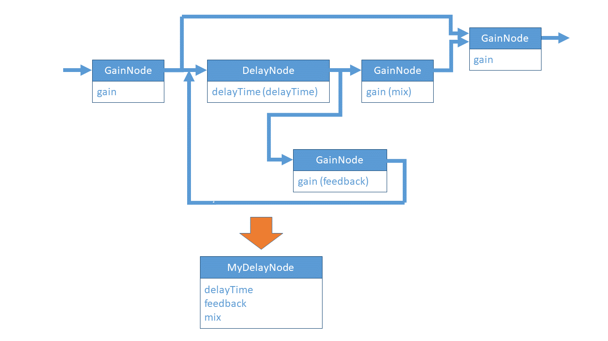

# webaudio-customnode

Repository : [https://github.com/g200kg/webaudio-customnode]()

## [Web Audio API] How to create custom AudioNode

In `Web Audio API` programming, I know that it is officially recommended to use `AudioWorklet` to create my own custom node. 

However, since `AudioWorklet` needs to scratch DSP fully, I can not miss the advantage of creating custom nodes in just a few combinations of existing nodes.

For example, the `DelayNode` of `Web Audio API` merely delays the signal, but as a general effector delay you always want a mix and feedback mechanism with the original sound.



I know there are already several such attempts.

However, it seems that there are many examples that do not support connect() to the created custom node in the same way as ordinary node. This is an example of solving the problem.

**Note:** This method is a trick to realize within the current specification. Future specifications may allow such things in a more natural way.

### Problem of connect()

`connect()` is a function used to connect nodes and parameters from a node.

If you create a custom node as a class unrelated to the Web Audio API, it can not be an argument to `connect()`.

### How should I do?

To avoid this, there is a way to create a custom node as a subclass of the input node (in most cases GainNode).

```js
class MyDelayNode extends GainNode {
  ...
}
```

The parent of the custom node will be the `GainNode` for input terminal. And in many cases, you will use one more `GainNode` as an output terminal.

The confusing thing is a handling `connect()` method of input/output. Check the handling of `_inputConnect` and `_outputConnect` with the following code. Like this, setting `connect()` of the output terminal after holding `connect()` from the input terminal will operate as expected.

```js
// Custom class definition
class MyDelayNode extends GainNode {
  constructor(actx,opt){
    super(actx);
    // Internal Nodes
    this._delayNode = new DelayNode(actx, {delayTime:0.5});
    this._mixNode = new GainNode(actx, {gain:0.5});
    this._feedbackNode = new GainNode(actx, {gain:0.8});
    this._outputNode = new GainNode(actx, {gain:1.0});

    // Export parameters
    this.delayTime = this._delayNode.delayTime;
    this.feedback = this._feedbackNode.gain;
    this.mix = this._mixNode.gain;

    // Options setup
    for(let k in opt){
      switch(k){
      case 'delayTime': this.delayTime.value = opt[k];
        break;
      case 'feedback': this.feedback.value = opt[k];
        break;
      case 'mix': this.mix.value = opt[k];
        break;
      }
    }

    this._inputConnect=this.connect;   // input side, connect of super class
    this.connect=this._outputConnect;  // connect() method of output

    this._inputConnect(this._delayNode).connect(this._mixNode).connect(this._outputNode);
    this._inputConnect(this._outputNode);
    this._delayNode.connect(this._feedbackNode).connect(this._delayNode);
  }
  _outputConnect(to){
    return this._outputNode.connect(to);
  }
}
```

Now, you can freely combine nodes and execute DSP between input and output GainNode.

Then, only the necessary parameters are exposed as properties of this node, and process the initial values of option, it becomes a custom node which behaves like the standard node.

### [MyDelayNode Working Sample](https://g200kg.github.io/webaudio-customnode/sample1.html)
